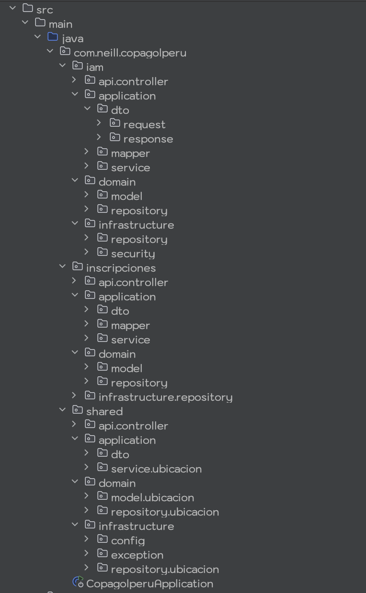

# CopaGol Peru - Sistema de Gestión de Torneos

   

## Índice
1. [Información del Proyecto](#1-información-del-proyecto)
2. [Propósito del Proyecto](#2-propósito-del-proyecto)
3. [Funcionalidades y Alcance](#3-funcionalidades-y-alcance)
4. [Módulos y Servicios REST](#6-módulos-y-servicios-rest)
5. [Pipeline CI/CD: Implementación](#7-pipeline-cicd-implementación)
6. [Infraestructura y Despliegue Cloud](#8-infraestructura-y-despliegue-cloud)

---

## 1. Información del Proyecto
**Desarrollado por:** Neill Elverth Olazabal Chavez

---

## 2. Propósito del Proyecto
**CopaGol Peru** es un sistema web diseñado para la gestión integral de academias de fútbol y torneos locales en un futuro. Su objetivo actual es digitalizar y automatizar el registro de jugadores, delegados, entrenadores, proporcionando una API robusta y segura para el consumo de clientes web y móviles.
El sistema resuelve la problemática de la gestión manual (papel y excel) automatizando:
* El registro fidedigno de identidades (Jugadores, Delegados).
* La gestión de plantillas de equipos por categorías.
* La exposición segura de datos mediante una API RESTful para futuros clientes móviles y web.
---

## 3. Funcionalidades y Alcance
El sistema abarca los siguientes procesos de negocio, modelados como casos de uso principales:

### Gestión Administrativa (Backoffice)
* **Gestión de Academias:** Registro de instituciones, validación de representantes y asignación de credenciales de acceso.
* **Auditoría de Usuarios:** Control de estado (Activo/Inactivo) de los usuarios del sistema.

### Gestión Deportiva (Academias)
* **Inscripción de Jugadores:** Creación de ficha técnica, carga de fotografías y validación de documentos (DNI).
* **Conformación de Equipos:** Asignación de jugadores a categorías específicas (Sub-6 a Sub-16).
* **Gestión de Staff:** Registro de Entrenadores y Delegados responsables.
* **Reportes:** Generación automática de planillas de inscripción en formato Excel.

---

## 4. Estructura del proyecto

---

## 4. Módulos y Principales Servicios REST

La API se ha documentado bajo el estándar **OpenAPI 3.0**, permitiendo probar los endpoints directamente desde el navegador.

* **Swagger UI (Interfaz Gráfica):** `http://localhost:8082/swagger-ui.html`
* **Docs JSON:** `http://localhost:8082/v3/api-docs`

A continuación, se describen los módulos principales implementados:

### Módulo 1: Autenticación y Usuarios (IAM)
**Propósito:** Gestionar el ciclo de vida de las sesiones de usuario, registro, validación de tokens JWT y permisos de administrador.

| Método | URL Endpoint | Parámetros (Body/Path) | Descripción |
| :--- | :--- | :--- | :--- |
| **POST** | `/api/auth/login` | **Body:** `{username, password}` | Autentica al usuario y devuelve el Token JWT + Rol. |
| **POST** | `/api/auth/register` | **Body:** `UserRequest` | Registra un nuevo usuario en la base de datos. |
| **GET** | `/api/auth/check` | **Header:** `Authorization: Bearer <token>` | Verifica si el token actual es válido y activo. |
| **GET** | `/api/auth/me` | **Header:** `Authorization: Bearer <token>` | Obtiene la información del perfil del usuario logueado. |
| **PATCH** | `/api/admin/users/{id}/toggle-status` | **Path:** `id` (UUID) | (Admin) Activa o desactiva el acceso de un usuario. |

**Modelos Clave:**
* `LoginRequest`, `LoginResponse` (Contiene el JWT).
* `User` (Entidad de seguridad).

---

### Módulo 2: Gestión de Academias
**Propósito:** Administración de las instituciones deportivas. Permite el registro, edición y visualización de academias, restringido por roles y permisos de propiedad.

| Método | URL Endpoint | Parámetros | Descripción |
| :--- | :--- | :--- | :--- |
| **GET** | `/api/academias` | (Admin) | Lista todas las academias registradas en el sistema. |
| **POST** | `/api/academias` | **Body:** `AcademiaRequest` | Crea una nueva academia (Solo Admin). |
| **GET** | `/api/academias/{id}` | **Path:** `id` | Obtiene el detalle de una academia específica. |
| **PUT** | `/api/academias/{id}` | **Path:** `id`, **Body:** `AcademiaRequest` | Actualiza datos de la academia. |
| **DELETE** | `/api/academias/{id}` | **Path:** `id` | Elimina (lógicamente) una academia. |

**Modelos Clave:**
* `AcademiaResponse`: DTO que expone los datos públicos de la academia.
* `AcademiaRequest`: DTO para validar datos de entrada.

---

### Módulo 3: Gestión de Equipos
**Propósito:** Organización de los equipos dentro de una academia, clasificados por categorías (Sub-X). Incluye la generación de reportes.

| Método | URL Endpoint | Parámetros | Descripción |
| :--- | :--- | :--- | :--- |
| **GET** | `/api/academias/{id}/equipos` | **Path:** `academiaId` | Lista los equipos pertenecientes a una academia. |
| **POST** | `/api/academias/{id}/equipos` | **Body:** `EquipoRequest` | Registra un nuevo equipo en una categoría. |
| **PUT** | `/api/academias/{id}/equipos/{id}` | **Body:** `EquipoRequest` | Edita los datos del equipo (color, nombre). |
| **GET** | `/api/academias/{id}/equipos/{id}/planilla` | **Path:** `id` | 📥 **Descarga un archivo Excel** con la planilla de jugadores del equipo. |

**Modelos Clave:**
* `Equipo` (Entidad): Relaciona Academia y Jugadores.
* `PlanillaExcel`: Recurso binario generado dinámicamente.

---

### Módulo 4: Gestión de Jugadores
**Propósito:** Administración de la ficha técnica de los deportistas asociados a un equipo específico.

| Método | URL Endpoint | Parámetros | Descripción |
| :--- | :--- | :--- | :--- |
| **GET** | `/api/academias/{acadId}/equipos/{eqId}/jugadores` | **Path:** `academiaId`, `equipoId` | Lista todos los jugadores de un equipo. |
| **POST** | `/api/academias/{acadId}/equipos/{eqId}/jugadores` | **Body:** `JugadorRequest` | Inscribe un jugador en el equipo. |
| **GET** | `/api/academias/{acadId}/equipos/{eqId}/jugadores/{id}` | **Path:** `id` | Obtiene el perfil detallado (incluyendo foto URL). |
| **PUT** | `/api/academias/{acadId}/equipos/{eqId}/jugadores/{id}` | **Body:** `JugadorRequest` | Actualiza datos del jugador. |

**Modelos Clave:**
* `Jugador` (Entidad): Contiene DNI, fecha nacimiento, foto, dorsal.

---

### Módulo 5: Personal Técnico (Delegados y Entrenadores)
**Propósito:** Gestión del staff responsable de la academia y los equipos.

| Método | URL Endpoint | Parámetros | Descripción |
| :--- | :--- | :--- | :--- |
| **GET** | `/api/academias/{id}/entrenadores` | **Path:** `academiaId` | Lista el cuerpo técnico de la academia. |
| **POST** | `/api/academias/{id}/entrenadores` | **Body:** `EntrenadorRequest` | Contrata/Registra un nuevo entrenador. |
| **GET** | `/api/academias/{id}/delegados` | **Path:** `academiaId` | Lista los delegados responsables. |
| **POST** | `/api/academias/{id}/delegados` | **Body:** `DelegadoRequest` | Registra un nuevo delegado. |

---

### Módulo 6: Ubicación Geográfica
**Propósito:** Proveer datos maestros de ubicación (Perú) para los formularios de registro.

| Método | URL Endpoint | Descripción |
| :--- | :--- | :--- |
| **GET** | `/api/ubicacion/departamentos` | Lista todos los departamentos. |
| **GET** | `/api/ubicacion/departamentos/{id}/provincias` | Lista provincias por departamento. |
| **GET** | `/api/ubicacion/provincias/{id}/distritos` | Lista distritos por provincia. |

---

## 5. Etapas y tareas de pipeline CI/CD: Detalles de implementación e integración

El ciclo de integración continua se ha orquestado exitosamente mediante Jenkins, ejecutando un flujo declarativo que abarca desde la obtención del código hasta el análisis de calidad y seguridad. A continuación, se detallan los resultados técnicos obtenidos en la última ejecución (Estado: `SUCCESS`).

### Construcción Automática
Se utiliza **Apache Maven** para la gestión del ciclo de vida del proyecto. La etapa de construcción limpia el entorno previo y empaqueta la aplicación excluyendo temporalmente los tests para optimizar tiempos.

* **Herramienta:** Maven Wrapper
* **Comando ejecutado:** `mvn clean package -DskipTests`
* **Tiempo de ejecución:** 4.190 s
* **Resultado:** BUILD SUCCESS
* **Artefacto generado:** `copagolperu-0.0.1-SNAPSHOT.jar`

### Análisis Estático
Integración con **SonarQube (v9.9)** para la inspección continua de la calidad del código. El escáner analizó la totalidad del código fuente bajo el perfil de calidad "Sonar way".

* **Alcance:** 138 archivos fuente indexados.
* **Análisis:** Detección de vulnerabilidades, code smells y duplicidad de código.
* **Estado:** ANALYSIS SUCCESSFUL. Reporte cargado al servidor SonarQube.
* **Quality Gate:** Aprobado.

### Pruebas Unitarias
Validación de la lógica de negocio aislada mediante **JUnit 5** y el plugin Maven Surefire. Se ejecutaron las pruebas definidas en la suite de `CopagolperuApplicationTests` y servicios asociados.

* **Total de pruebas:** 6
* **Fallos / Errores:** 0 / 0
* **Tiempo total:** 8.076 s
* **Conclusión:** Integridad lógica validada al 100%.

### Pruebas Funcionales
Verificación automatizada de los endpoints de la API utilizando **Postman** y su ejecutor de línea de comandos **Newman**. Se validó la disponibilidad y las respuestas HTTP correctas del servicio.

* **Endpoint verificado:** `GET /api/academias`
* **Iteraciones:** 1
* **Aserciones:** 2 validaciones exitosas (Status Code y Disponibilidad).
* **Tiempo promedio de respuesta:** 179ms
* **Resultado:** El servicio responde correctamente según el contrato de interfaz.

### Pruebas de Seguridad (DAST)
Ejecución de un análisis dinámico de seguridad utilizando **OWASP ZAP 2.16.0** en modo headless (sin interfaz gráfica). El escáner verificó la robustez de los endpoints expuestos.

* **Configuración:** Ejecución local en puerto 8888.
* **Objetivo:** Endpoint `/api/academias`.
* **Respuesta del Sistema:** Código 401 Unauthorized.
* **Interpretación:** La seguridad de Spring Security bloqueó exitosamente el intento de acceso no autorizado por parte del escáner.
* **Entregable:** Reporte HTML de vulnerabilidades generado en el workspace.

### Pruebas de Performance
Pruebas de carga y estrés realizadas con **Apache JMeter 5.6.3** para medir la latencia y el throughput del servidor bajo demanda simulada.

* **Muestras:** 10 peticiones concurrentes.
* **Tasa de error:** 0.00% (Estabilidad total).
* **Tiempo promedio:** 48 ms.
* **Rendimiento (Throughput):** 10.6 peticiones/segundo.
* **Conclusión:** La aplicación mantiene tiempos de respuesta estables bajo la carga probada.

### Gestión de Issues
La trazabilidad de los cambios se gestiona mediante la vinculación de commits con **GitHub Issues**. Cada funcionalidad o corrección implementada en el código referencia un ticket específico, permitiendo un seguimiento granular del desarrollo.

### Gestión de Entrega (Despliegue)
El proyecto está configurado para una arquitectura basada en contenedores, facilitando su portabilidad y despliegue.

* **Empaquetado:** Archivo JAR ejecutable autocontenido (Spring Boot).
* **Contenerización:** `Dockerfile` basado en la imagen `openjdk:17-jdk-alpine`, optimizado para entornos de producción.

---

## 6. Infraestructura y Despliegue Continuo (Cloud CD)

Como complemento al pipeline de integración en Jenkins, se ha implementado una arquitectura de **Despliegue Continuo (CD)** utilizando la plataforma **Railway**. Esta configuración garantiza que la versión productiva de la aplicación esté siempre sincronizada con la rama principal del repositorio.

### Arquitectura de Despliegue
La infraestructura en la nube está compuesta por dos servicios gestionados:

1.  **Servicio de Aplicación (Backend):**
  * Contenedor Spring Boot que aloja la API REST.
  * **Trigger de Despliegue:** Vinculación automática mediante Webhooks a la rama `main` de GitHub. Al aprobarse un Pull Request y fusionarse el código, Railway detecta el cambio, construye la imagen Docker y despliega la nueva versión sin intervención manual.
  * **Gestión de Variables:** Las credenciales de base de datos y tokens JWT se inyectan como variables de entorno seguras en tiempo de ejecución.

2.  **Servicio de Base de Datos:**
  * **Motor:** PostgreSQL (Instancia gestionada en Railway).
  * **Conectividad:** La aplicación se comunica a través de la red interna privada de Railway, garantizando baja latencia y seguridad en la transferencia de datos.

### Acceso al Entorno de Producción
La API se encuentra desplegada y accesible públicamente para consumo de clientes externos:

* **URL Base de Producción:** https://api.copagolperu.com
